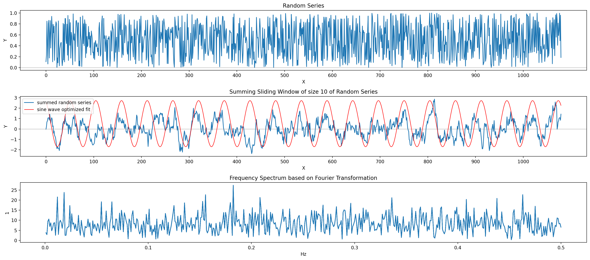

# The Slutksy Effect vs. Cycles

The slutsky effect was described by Eugen Slutsky in and described in his
journal article
[The Summation of Random Causes as the Source of Cyclic Processes](https://www.jstor.org/stable/1907241)
which appeared in 1927 (and got only translated into English 10 years later).
He demonstrated how patterns akin to the price action of stock markets or whole
economic cycles can emerge from random time series by a simple sliding window
sum transformation. With this Jupyter Notebook, I want to provide an
implementation and visualization of Slutsy's discovery and put this up for debate
as a potential debunk of cycle theories.

## Background

In 2022 I came across Edward R. Dewy and his striving to establish the _cycles studies_ as a new scientific domain.
I have consumed a lot of publications published by the _Foundation for the Studies of Cycles_ (FSC) and became a member there.
I took an open stance towards the cycles related observations even though there is a lack of any
reasoning of what they might be caused by, other than a yet to be discovered 'force'.
The claim is basically that cycles are ubiquitous and can thus be
found in nature as well as sociological, economical, political and cosmological phenomenons.
When I took the opposite stance and scrutinized this universalistic claim, I came across
the slutsky effect which baffled me even more than the few really persuasive evidences for cycles.

## Example

This example is the ouput of this [notebook](slutsky.ipynb) which shows how the periodic looking pattern in the second plot
emerges from a random series shown in the first plot.
The blue plot has a sliding window sum operation applied while the red one suggest the periodicity.
The third plot just shows the frequeny spectrum determined using the fourier transformation.
The red sine wave in the second plot is an optimized sine wave fit with an initial frequency
picked from beginning of the spectrum (lower frequencies).

## Conclusion

I deem the slutsky effect as a comprehensible explanation for cycles which involve humans and
thus as a counter argument for the cycles theory as a whole. This is because we humans have a strong recency bias
which means we are aggregating random data points in a similar way as in the sliding window operation
in the Slutsy algorithm. Because the signal we get is continuation, we bank on it and thus help the current trend to prevail.
That does not mean things are forever moving in one direction; at some point
there is a tipping point caused by some external and/ or underlying circumstances which may be in turn caused by the decisions of some powerful enough men
(who I might not even have elected because they are from a different county and thus had no control over whatsoever).
Then, the same feedback loop works in the opposite direction and keeps it moving on that trajectory for a while.
An external event could be a general stock market crash and an underlying event could be a company with a good track record
releasing a malfunctioning new generation of a product, in other words, a company intrinsic event.
We can only look back and we do so, whether that is consciously or unconsciously, but we cannot predict the future based on this retrospective.

## Addendum

If you belive in cycles, you might find [my prediction for the 2024 US presidential elections](US_PRESIDENTIAL_ELECTIONS_CYCLE_ANALYSIS.md) interesting.

## References

- https://www.jstor.org/stable/1907241
- https://www.minneapolisfed.org/article/2009/the-meaning-of-slutsky
- https://en.wikipedia.org/wiki/Edward_R._Dewey
- https://cycles.org
- https://en.wikipedia.org/wiki/Recency_bias
