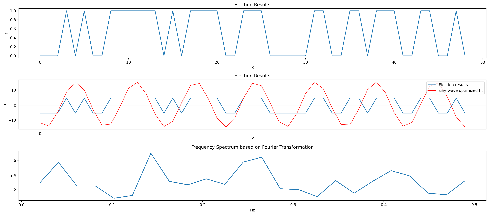

# US Presidential Elections Cycles Analysis

Let's assume, for the fun of it, even though
[I concluded that Cycles emerge from random causes](README.md), that Cycles do have predictive powers. Who would win the upcoming US presidential elections in 2024?

## Result

The results plot shows past results back to the year 1828 where `0` means a Democrats wind and `1` a Republicans win.

If we extrapolate the sine wave fit into the future then we must assume at least two wins for the Republicans in the upcoming three elections if this cycles analysis was only remotely useful for predictions.
